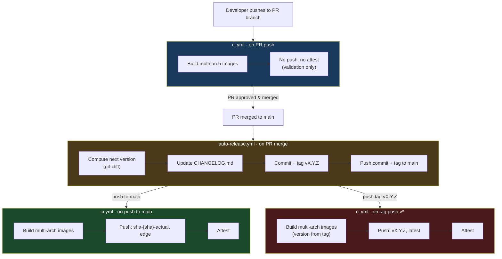

# Release Process

## Overview

Aura releases automatically on every PR merge to `main`. There is no manual release step.

When a PR is merged, a release commit is created with an updated `CHANGELOG.md` and a new version tag. That tag push then triggers the container build and publish pipeline.

---

## Tag Lifecycle

| Stage             | Tag format                 | Applied by              |
| ----------------- | -------------------------- | ----------------------- |
| Merged to main    | `sha-{sha}-actual`, `edge` | `ci.yml` (push to main) |
| Released (stable) | `v{X.Y.Z}`, `latest`       | `ci.yml` (tag push)     |

---

## Pipeline Stages

### 1. Pull Request - Build only (`ci.yml`)

Triggered on every push to a PR branch.

- Runs Rust build and tests.
- Builds multi-platform Docker images (`amd64`, `amd64/v2`, `amd64/v3`, `arm64`) in parallel.
- **Does not push or attest.** Build is validation only.

### 2. Merge to main - Auto release (`auto-release.yml`)

Triggered when any PR is merged into `main`.

- Computes the next semantic version using `git-cliff`.
- Updates `CHANGELOG.md`.
- Commits the changelog and creates a git tag (`vX.Y.Z`).
- Pushes the commit and tag to `main`.

This push triggers two `ci.yml` runs simultaneously (one per ref):

### 3a. Push to main - Edge build and publish (`ci.yml`)

- Builds multi-arch images from the release commit.
- Pushes to Docker Hub: `sha-{sha}-actual`, `edge`.
- Attests the image.

### 3b. Tag push - Release build and publish (`ci.yml`)

- Extracts the version from the tag name and embeds it in the binary via `cargo set-version`.
- Builds multi-arch images.
- Pushes to Docker Hub: `v{X.Y.Z}`, `latest` (stable tags only — excluded for pre-release suffixes like `-rc.1`).
- Attests the image.

---

## Flow Diagram

